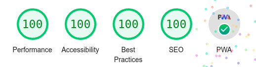

# TP2 - Advanced web development

> **URL** : [https://app.some-very-furtive.blog](https://app.some-very-furtive.blog)

Again, I have helped Tom Mansion, Léandre Becq, Rémy Chagnas and Nathan Pinault.
And these gentle guys helped me too!

Loreleï Augeraud and Tom Ravanel gave me a hand for some minor Lighthouse issues.

Apparently, it works perfectly in desktop mode (luckily? Hmm... Don't say that).



*Tested on Google Chrome browser (version : `100.0.4896.88`)*

## Notes

For HTTPS setup on my VPS, I have followed the instructions in [nginx-certbot boilerplate](https://github.com/wmnnd/nginx-certbot). 
Organization and init script had been changed a bit to match with my configuration. You can find some of the files in `config` folder. They are not managed by CD but directly on VPS.

---

## Commands

### Run a server locally

#### With Service Worker enabled

```bash
ng build --configuration development
```

Then set up a server using `http-server` on generated `/dist/simple-app` folder :

```bash
http-server -p {port} -c-1 dist/simple-app/
```

You can access to it in [http://localhost:port](http://localhost:port). 

#### Without Service Worker

```bash
ng serve
```

By default, the app URL is set up on [http://localhost:4200](http://localhost:4200).

### Run API server locally

`baseUrl` in  `src/environnements/environment.ts` must match with the url used by the server.

```bash
json-server --watch db/db.json
```

You can visit and try routes on it on [http://localhost:3000](http://localhost:3000).
